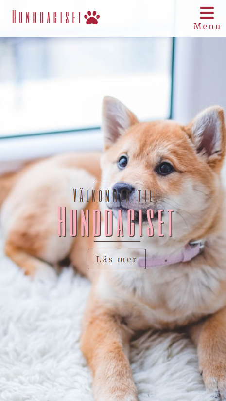

# Doggy-daycare
Responsive webbpage for a doggy daycare website I made for a course in Responsive Web design on Högskolan Kristianstad spring 2019.
Most images are from Pexels.com.
For now you can view the site at http://www.webshare.hkr.se/HEJO0128/Projekt/index.html

The layout uses CSS Flexbox. And implements some designpatterns like Porgressive disclosure and off-canvas. No Javascript on this one.

## Preview

